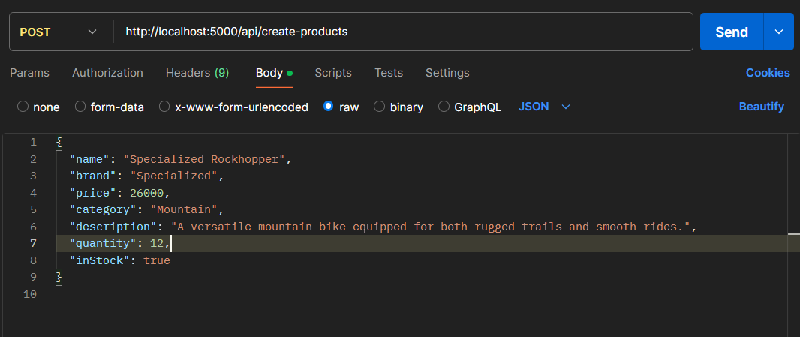

# Bike Store

Develop an Express.js application using TypeScript to manage a Bike Store. The app integrates MongoDB (via Mongoose) for data storage and ensures data integrity through schema validation.

## **Features**

- Manage **Products** (Bikes) and **Orders** using CRUD operations.
- Maintain inventory integrity with real-time stock updates.
- Validate and handle errors with user-friendly responses.
- Calculate total revenue from orders using MongoDB aggregation.

##Endpoints

1. Product (Bike) Management
   - Create a Bike
   - URL: /api/products
   - Method: POST
   - Request Body:
     
